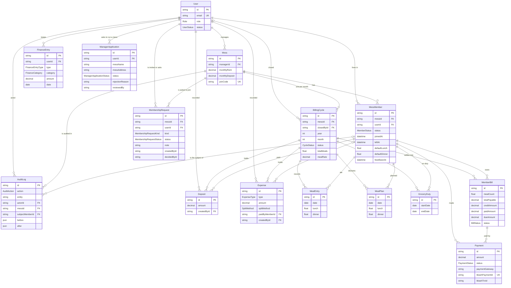

# MessMate - Entity Relationship Diagram

15 models, one per schema file under `prisma/schema/`, and all 28 of their
relations. The diagram is written by hand, so it can drift from the schema - it
was last checked foreign key by foreign key: every `@relation` in
`prisma/schema/` is drawn below, and every line below is a real `@relation`.

Three relationships carry most of the design:

- **`MessMember` sits between `User` and `Mess`.** One person can live in more
  than one mess, and every meal, expense and bill hangs off the membership
  rather than the user - so someone who leaves keeps their history in the months
  they were there.
- **`BillingCycle` owns the month.** Meals, plans, expenses, deposits and duty
  all belong to a cycle, which is what makes closing the month a single,
  well-defined operation.
- **`MealPlan` and `MealEntry` are deliberately separate.** A plan is what a
  member declared in advance; an entry is what the manager recorded as eaten.
  Only entries are charged. Merging them would let a declaration quietly become
  a charge.

**Joining is a request, not a status.** `MembershipRequest` holds every
invitation (`kind: INVITE`) and every request to join (`kind: REQUEST`) until
it is answered. A pending person is deliberately not a `MessMember`: a dozen
reads - meals, deposits, duty, the settlement - only check `isDeleted`, so a
"pending" member there would quietly be billed. Only an accepted request creates
the membership, or reactivates a `LEFT` one. `createdById` and `decidedById` are
plain ids, not relations: who asked and who answered is history, and must
survive either account.

`ManagerApplication` is the same idea one level up: someone asking to run a
mess, answered by an admin. Every application is its own row, so the history of
a rejected-then-approved applicant stays readable.

`FinanceEntry` hangs off `User`, not `MessMember`, on purpose: a person's own
income and spending belong to them, not to whichever mess they live in, and
survive moving out.

## The audit trail

An `AuditLog` row answers three questions, and each has its own column:

| Column | Answers | Set on |
| --- | --- | --- |
| `actorId` | who did it | every row |
| `messId` | which mess it happened in | every mess-scoped row |
| `subjectMemberId` | who it was about | rows about one person |

The two optional columns are what let the same table serve three readers. The
platform admin reads everything. A manager reads the rows where `messId` is
theirs. A member reads only the rows where `subjectMemberId` is their own
membership - the meal a manager recorded against them, a deposit of theirs
deleted, a payment of theirs settled.

Closing or reopening a cycle touches every member at once, so it carries a
`messId` but no subject, and never appears in a member's view. A role change or a
block is a platform action with neither, so it never reaches any mess view.

`subjectMemberId` points at `MessMember`, not `User`, for the same reason
everything else does: a person in two messes has two memberships, and a meal in
one mess is nothing to do with the other.

## Constraints that carry meaning

| Constraint | Prevents |
| --- | --- |
| `BillingCycle(messId, year, month)` | two ledgers for one month |
| `MealEntry(memberId, date)` | double-counting a day |
| `MealPlan(memberId, date)` | two declarations for the same day |
| `MemberBill(cycleId, memberId)` | two bills for one member |
| `Payment.bkashPaymentId` | a replayed callback creating a second payment |
| `Mess.joinCode` | two messes answering to one code |
| `ManagerApplication(userId) WHERE status = 'PENDING'` | two waiting applications from one person |
| `MembershipRequest(messId, userId) WHERE status = 'PENDING'` | an invitation and a request racing for the same seat |

The last two are partial unique indexes. Prisma cannot express them, so they
are written by hand in their migrations.

`MemberBill.status` is `UNPAID`, `PARTIAL`, `PAID` or `CARRIED`. A carried bill's
balance opened the next closed month, so it is kept for history with nothing
due.

## Deletion rules

Most children cascade from `BillingCycle`, so removing a mess removes the months
under it rather than leaving orphans. `Payment` cascades from its `MemberBill`,
because reopening a cycle deletes the bills so the settlement can be regenerated.
A settled payment never reaches that path, since reopen is refused once any
payment lands against the month.

`AuditLog` cascades from its `Mess` and its subject `MessMember`, so a deleted
mess takes its trail with it. Its `actorId` does the opposite - `ON DELETE
RESTRICT` - so the database refuses to remove a user who has acted while that
trail exists. The same holds for whoever recorded a deposit or an expense: a
record of who did something is worth nothing if deleting them could erase it. In
practice it never comes up, because accounts are soft-deleted and the row stays.

`ManagerApplication` and `MembershipRequest` cascade from their user and mess:
with the person or the mess gone, a request has nothing left to answer.

`BillingCycle.closedById` is the one exception, and it is `SET NULL` on purpose:
a closed month has to survive losing the name of whoever closed it.

Nothing is hard-deleted through the API. `isDeleted` + `deletedAt` mark a row and
every read filters them out.

Money is `Decimal`, never `Float`. Meal counts are the one deliberate `Float`:
`MealEntry.lunch`/`.dinner`, `MealPlan.lunch`/`.dinner`,
`MemberBill.mealCount` and `BillingCycle.totalMeals`: a real register records
half meals, and multiples of `0.5` are exact in binary floating point, so nothing
drifts. Validation enforces that step - a mess has half meals, not thirds.
