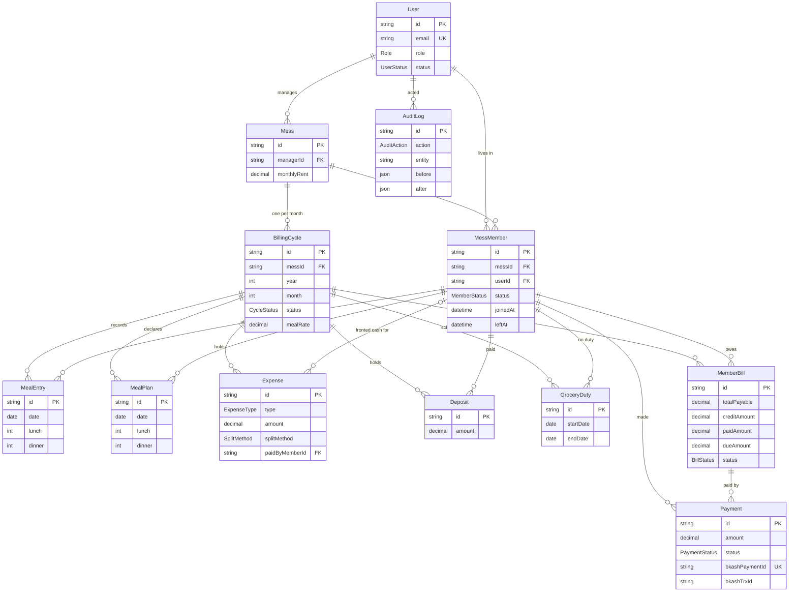

# MessMate — Entity Relationship Diagram

12 models, one per schema file under `prisma/schema/`. Generated from the actual
schema, so the diagram and the database cannot drift apart.

Three relationships carry most of the design:

- **`MessMember` sits between `User` and `Mess`.** One person can live in more
  than one mess, and every meal, expense and bill hangs off the membership
  rather than the user — so someone who leaves keeps their history in the months
  they were there.
- **`BillingCycle` owns the month.** Meals, plans, expenses, deposits and duty
  all belong to a cycle, which is what makes closing the month a single,
  well-defined operation.
- **`MealPlan` and `MealEntry` are deliberately separate.** A plan is what a
  member declared in advance; an entry is what the manager recorded as eaten.
  Only entries are charged. Merging them would let a declaration quietly become
  a charge.

## Constraints that carry meaning

| Constraint | Prevents |
| --- | --- |
| `BillingCycle(messId, year, month)` | two ledgers for one month |
| `MealEntry(memberId, date)` | double-counting a day |
| `MealPlan(memberId, date)` | two declarations for the same day |
| `MemberBill(cycleId, memberId)` | two bills for one member |
| `Payment.bkashPaymentId` | a replayed callback creating a second payment |

## Deletion rules

Most children cascade from `BillingCycle`, so removing a mess removes the months
under it rather than leaving orphans. `Payment` cascades from its `MemberBill`,
because reopening a cycle deletes the bills so the settlement can be regenerated
— a settled payment never reaches that path, since reopen is refused once any
payment lands against the month.

Nothing is hard-deleted through the API. `isDeleted` + `deletedAt` mark a row and
every read filters them out. Money is `Decimal`, never `Float`.
